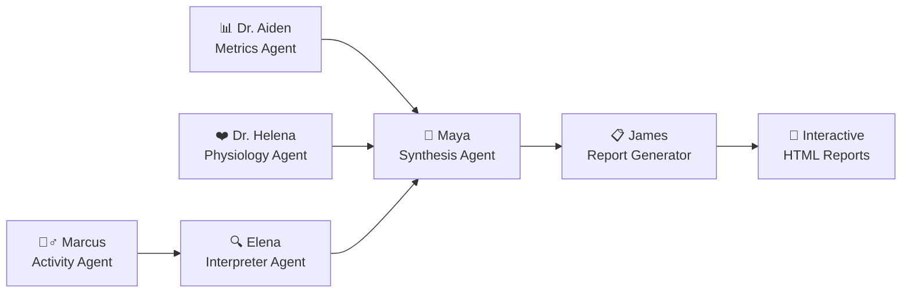
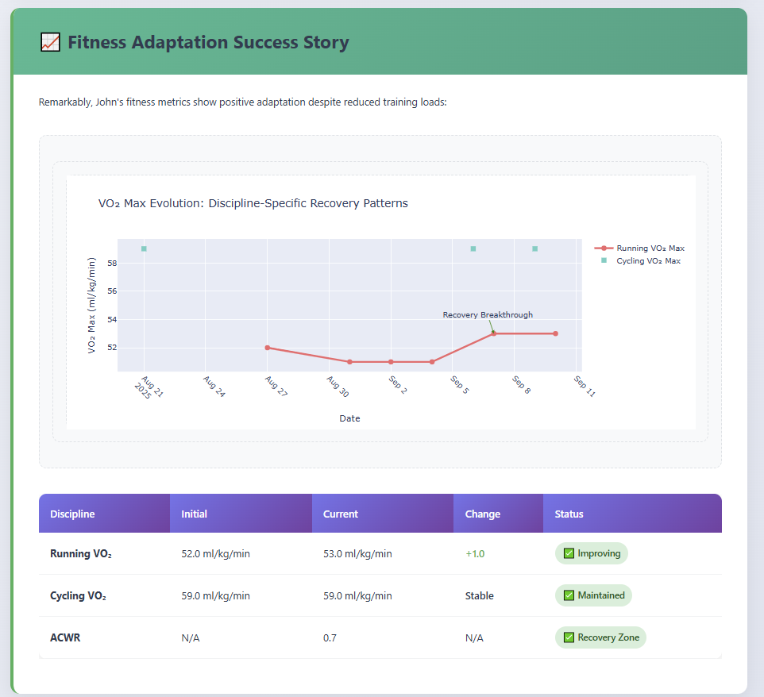
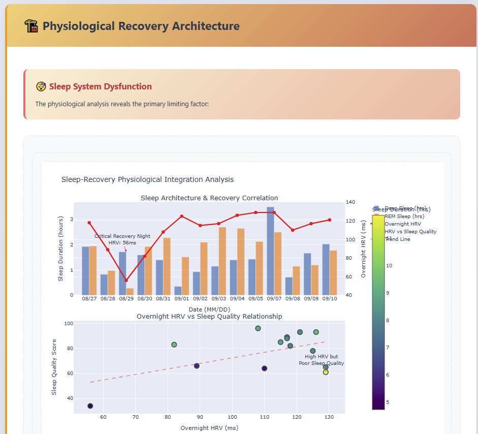
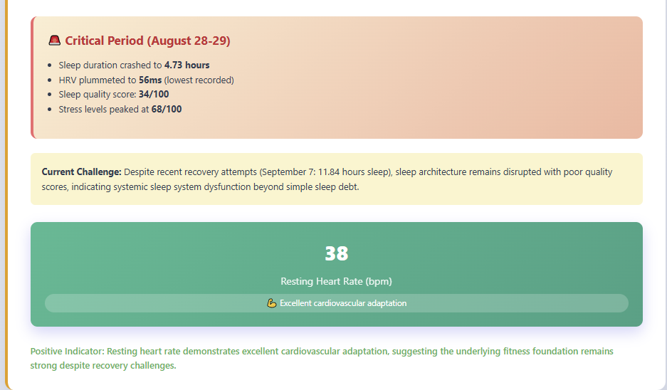
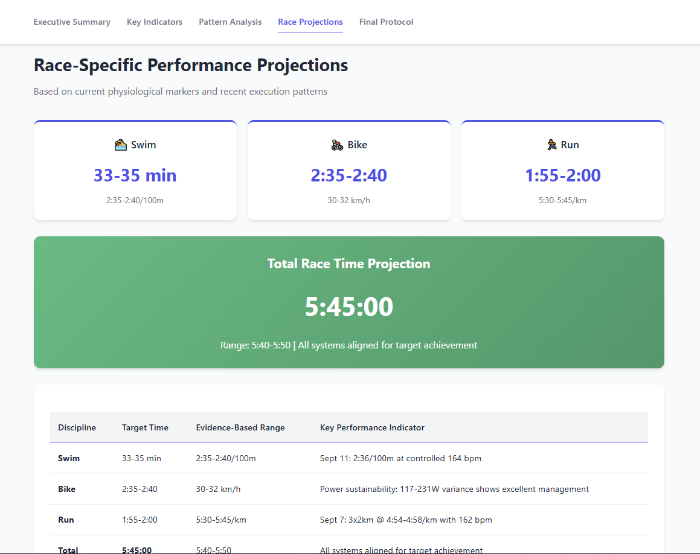
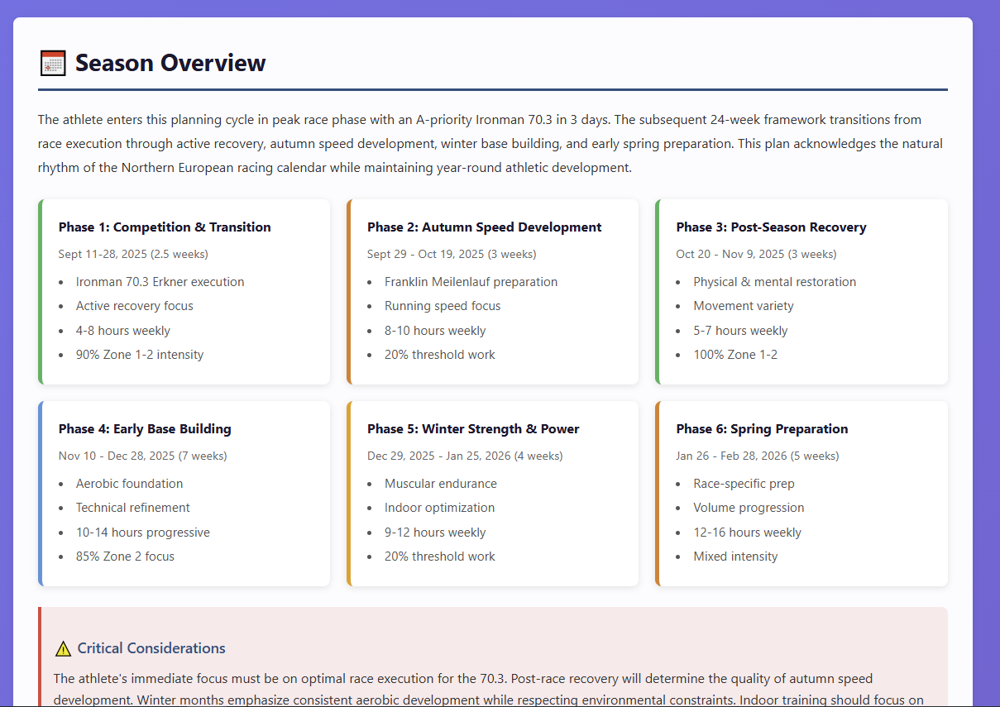
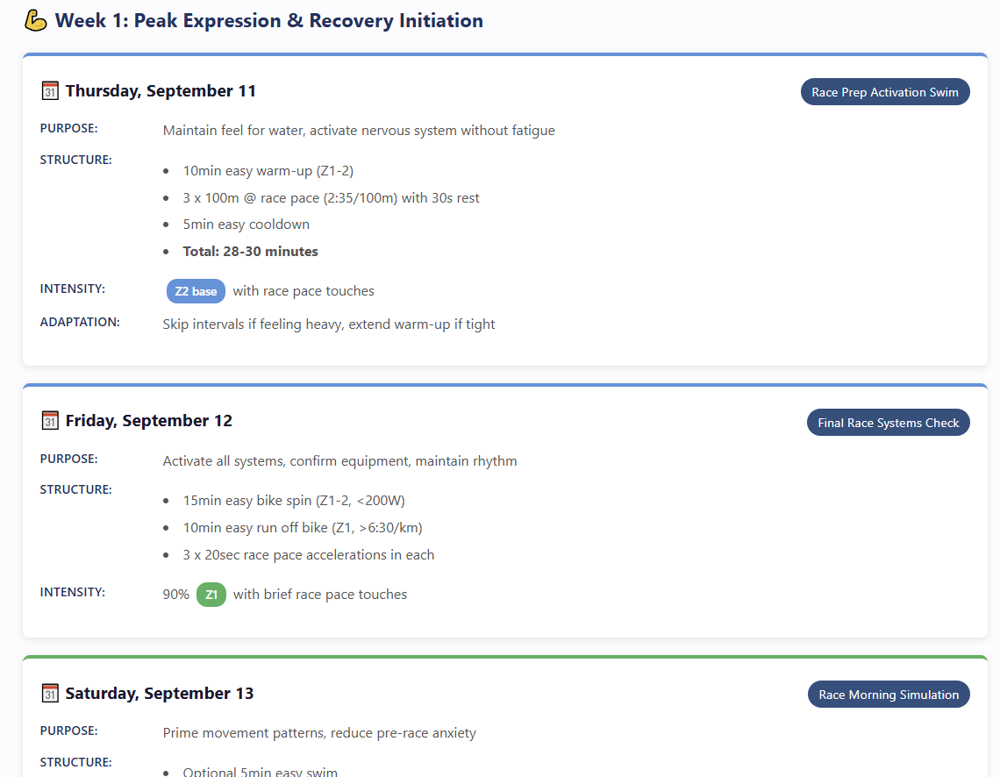

# 🏊‍♂️🚴‍♂️🏃‍♂️ Tele Garmin — Your AI Triathlon Coach

> **Transform your Garmin Connect data into personalized insights, training plans, and race prep strategies using a sophisticated multi-agent AI system.**

[](https://python.org)
[](https://langchain-ai.github.io/langgraph/)
[](https://github.com)
[](LICENSE)

---

## ✨ What Makes This Special

🤖 **10 Specialized AI Agents** working in parallel to analyze every aspect of your training  
📊 **Beautiful Interactive Reports** with professional charts and actionable recommendations  
💬 **Conversational Interface** through Telegram with real-time progress tracking  
⚡ **Headless CLI Mode** for automated, config-driven analysis  
🔒 **Security-First Design** with local encrypted credentials and zero cloud storage  
📈 **Professional Observability** with LangSmith integration and cost tracking

---

## 🎯 See It In Action

### Your Personal AI Coaching Team



**Each agent brings specialized expertise:**
- **Dr. Aiden Nakamura** (Metrics) - Training load, VO₂ max trends, performance metrics
- **Marcus Chen** (Activity Data) - Raw training data processing and pattern recognition
- **Elena Rodriguez** (Activity Interpreter) - Training pattern analysis and execution insights
- **Dr. Helena Virtanen** (Physiology) - Recovery, stress, and physiological markers
- **Maya Lindholm** (Synthesis) - Combines insights into comprehensive analysis
- **James Morrison** (Formatter) - Creates beautiful, actionable reports

### 📊 Beautiful Analysis Reports


*AI-generated performance synthesis with key findings and executive summary*


*Sophisticated training load progression analysis with ACWR monitoring*


*Real-time physiological monitoring with HRV, stress patterns, and VO₂ max tracking*


*Competition timeline and integrated readiness scoring across all analysis domains*

**Analysis Report Features:**
- 🎯 **Executive Summary** with key findings and readiness scores
- 📈 **Interactive Training Load Charts** with ACWR analysis
- ❤️ **Physiological Adaptation Tracking** (HRV, stress patterns, VO₂ max)
- ⚠️ **Critical Pattern Analysis** identifying training inconsistencies
- 🏁 **Competition Readiness Assessment** with timeline planning
- 💡 **Actionable Recommendations** prioritized by urgency

### 📅 Detailed Training Plans


*Comprehensive 28-week periodized training plan with phase-specific goals and timeline*


*Detailed day-by-day workout structure with intensity zones, adaptations, and monitoring guidance*

**Planning Report Features:**
- 🏗️ **Season-Long Periodization** with phase-specific goals
- 📋 **Day-by-Day Workout Details** with intensity zones and adaptations
- 🎯 **Training Zone References** for running, cycling, and swimming
- 📊 **Volume and Intensity Monitoring** with built-in flexibility
- 🔄 **Adaptive Workout Options** based on readiness and fatigue

---

## 🚀 Quick Start

### Option 1: Telegram Bot Interface (Conversational UX)

```bash
# Start the bot
pixi run start-dev
```

**Chat Commands:**
- `/start` → Initialize your coaching experience
- `/login` → Secure Garmin Connect authentication
- `/coach` → Trigger comprehensive analysis + weekly planning
- `/races` → Manage your competition calendar
- `/help` → Quick reference guide

### Option 2: CLI Interface (Headless Automation)

```bash
# Create your configuration
pixi run coach-init my_training_config.yaml

# Edit the config with your details, then run
pixi run coach-cli --config my_training_config.yaml
```

**Outputs:**
- `analysis.html` - Comprehensive performance analysis
- `planning.html` - Detailed weekly training plan  
- `summary.json` - Metadata and cost tracking

---

## 💻 Installation & Setup

### Prerequisites
- **Garmin Connect Account** - Your training data source
- **Telegram Bot Token** (for bot interface) - [Get one from @BotFather](https://t.me/botfather)
- **Anthropic API Key** - Primary LLM provider

### Using Pixi (Recommended)

1. **Create your environment file:**
```bash
# .env.dev
TELE_BOT_KEY=123456789:your_telegram_bot_token
ANTHROPIC_API_KEY=sk-ant-api03-...

# Optional providers
OPENAI_API_KEY=sk-...
OPENROUTER_API_KEY=...
LANGSMITH_API_KEY=lsv2_...  # For professional observability

# AI mode: standard | development | cost_effective  
AI_MODE=development
```

2. **Install and run:**
```bash
pixi run start-dev     # Development mode
# or
pixi run start-prod    # Production mode (expects .env)
```

### Alternative Installation
```bash
pip install -r requirements.txt
python main.py
```

---

## 🎛️ AI Configuration & Models

### AI Modes
Choose your analysis depth and cost balance:

- **`development`** - Fast iterations, cost-effective (7-14 days data)
- **`standard`** - Comprehensive analysis (21-56 days data) 
- **`cost_effective`** - Balanced approach for budget-conscious users

### Supported LLM Providers

**🧠 Anthropic Claude** (Primary)
- `claude-4`, `claude-4-thinking`
- `claude-opus`, `claude-opus-thinking`  
- `claude-3-haiku`

**🤖 OpenAI**
- `gpt-4o`, `gpt-4.1`, `gpt-4.5`
- `gpt-4o-mini`, `o3`, `o3-mini`

**🚀 OpenRouter/DeepSeek**
- `deepseek-chat`, `deepseek-reasoner`

*Configure in [`services/ai/ai_settings.py`](services/ai/ai_settings.py) by updating the `stage_models` mapping.*

---

## 📋 Sample Configuration

```yaml
# Athlete Information
athlete:
  name: "John Doe"
  email: "john.doe@example.com"  # Garmin Connect email

# Analysis Context  
context:
  analysis: |
    Coming back from a minor injury. Focusing on base building and
    avoiding high-intensity work for the next 2 weeks.
  planning: |
    Preparing for Olympic distance triathlon in 12 weeks.
    Priority is building aerobic base and improving run endurance.

# Data Extraction Settings
extraction:
  activities_days: 7       # Recent training data
  metrics_days: 14         # Physiological trends  
  ai_mode: "development"   # Analysis depth

# Upcoming Competitions
competitions:
  - name: "Local Olympic Triathlon"
    date: "2026-04-15"
    race_type: "Olympic"
    priority: "A"              # A (highest), B, C priorities  
    target_time: "02:30:00"

output:
  directory: "./data"
```

---

## 🏗️ Architecture Deep Dive

### LangGraph Workflow System
Modern state-based AI orchestration with built-in observability:

```python
# Parallel Analysis Phase
START → [Metrics, Physiology, Activity Data] → Activity Interpreter
                ↓                ↓                    ↓
            Synthesis Agent ← ← ← ← ← ← ← ← ← ← ← ← ←
                ↓
         HTML Formatter → Plot Resolution → END
```

**Key Benefits:**
- ✅ **67% Code Reduction** - From 800+ lines to 300 lines vs legacy LangChain
- ✅ **Built-in Observability** - Professional LangSmith monitoring  
- ✅ **Parallel Execution** - Metrics + Physiology agents run simultaneously
- ✅ **Automatic State Management** - Typed state with reducers
- ✅ **Error Recovery** - Node-level handling and retries

### Security Architecture

```
🔐 Local Encryption → 📊 Data Processing → 🤖 AI Analysis → 📋 Report Generation
     (Per-user keys)      (In-memory)        (API calls)      (Local storage)
```

- **Encrypted Credentials** - AES-256 encryption with per-user keys
- **Local Data Storage** - No cloud persistence of personal data
- **Secure API Calls** - Direct LLM provider communication
- **Usage Tracking** - Transparent cost monitoring

---

## 📊 Project Structure

```
garmin-ai-coach/
├── 🤖 bot/                     # Telegram interface & handlers
├── 🔒 core/security/           # Encryption & usage limits
├── 🔧 services/
│   ├── 🏃‍♂️ garmin/              # Data extraction & models  
│   ├── 🧠 ai/langgraph/        # Modern AI workflow system
│   └── 🎨 ai/tools/plotting/   # Secure visualization tools
├── 📚 agents_docs/             # Architecture & planning docs
├── ⚡ cli/                     # Headless interface
├── 🚀 main.py                  # Entry point
└── ⚙️ pixi.toml                # Dependencies & tasks
```

---

## 🔧 Development Commands

```bash
# Code Quality
pixi run lint-ruff              # Linting
pixi run ruff-fix              # Auto-fix issues  
pixi run format                # Black + isort formatting
pixi run type-check            # MyPy type checking

# Testing & Analysis
pixi run test                  # Run test suite
pixi run dead-code             # Find unused code (Vulture)

# Utilities  
pixi run list-users            # User management
```

---

## 🎯 What's Next

### 🔮 Roadmap
- **🔗 Platform Integration** - Wahoo Integration

### 🏆 Success Stories
*"The AI coaching insights helped me identify training inconsistencies I never would have caught myself. My Olympic distance time dropped by 8 minutes!"*

---

## 💡 Why Tele Garmin?

**For Athletes:**
- 🎯 Get personalized insights your Garmin doesn't provide
- 📈 Understand your training patterns and physiological adaptations
- 🏃‍♂️ Receive science-backed recommendations for improvement
- ⏰ Save hours of manual data analysis

**For Coaches:**
- 📊 Comprehensive athlete analysis in minutes, not hours
- 🧠 AI-powered pattern recognition across multiple data streams
- 📋 Professional reports to share with athletes
- 🔍 Identify training issues before they become problems

**For Developers:**
- 🏗️ Modern LangGraph architecture with professional observability
- 🔒 Security-first design with comprehensive encryption
- 📈 Scalable multi-agent system with parallel processing
- 🎨 Beautiful visualization tools and report generation

---

## 📄 License

MIT License - see [LICENSE](LICENSE) for details.

---

## 🤝 Contributing

We welcome contributions! The codebase uses modern Python practices with:
- **LangGraph** for AI workflow orchestration
- **Pydantic v2** for data validation  
- **Pixi** for dependency management
- **Ruff + Black** for code formatting

*Built with ❤️ for the triathlon community*

---

**Ready to transform your training data into actionable insights?**

```bash
git clone https://github.com/your-username/garmin-ai-coach.git
cd garmin-ai-coach
pixi run start-dev
```

*Your AI triathlon coach awaits! 🏊‍♂️🚴‍♂️🏃‍♂️*