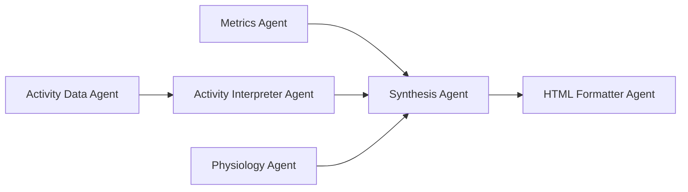

# Codebase Summary

## Project Overview

**tele_garmin** is an AI-powered triathlon coaching system that analyzes Garmin Connect training data using sophisticated multi-agent LangChain orchestrators. The system generates comprehensive training insights, weekly plans, and performance analysis reports.

## Key Components and Their Interactions

### Core Architecture

```
User Authentication -> Data Extraction -> AI Analysis -> Report Generation
     |                      |                 |              |
SecureCredentialManager -> GarminData -> LangChain Agents -> HTML Reports
```

### Primary Components

#### 1. Authentication & Security (`core/security/`)
- **SecureCredentialManager** - Encrypted storage of Garmin credentials
- **SecureReportManager** - Manages analysis report storage
- **SecureCache** (Metrics, Activity, Physiology) - Caches analysis results
- **ExecutionTracker** - Tracks usage limits and execution history

#### 2. Data Extraction (`services/garmin/`)
- **TriathlonCoachDataExtractor** - Main data extraction orchestrator
- **GarminConnectClient** - Low-level Garmin Connect API interface
- **Models** - Pydantic data models (GarminData, Activity, UserProfile, etc.)
- **ExtractionConfig** - Configurable data extraction parameters

#### 3. AI Analysis Pipeline (`services/ai/langchain/`)
- **MasterOrchestrator** - Coordinates analysis and planning flows
- **AnalysisOrchestrator** - Multi-agent training analysis
- **WeeklyPlanOrchestrator** - Training plan generation
- **AnalysisChains** - Individual AI agent implementations
- **PlottingTool** - Secure chart/visualization generation

#### 4. Telegram Interface (`bot/`)
- **TelegramBot** - Main bot class and setup
- **CommandHandlers** - Basic bot commands (/start, /help, etc.)
- **CoachHandlers** - AI analysis workflow handlers
- **ConversationHandlers** - Multi-step user interactions

### Data Flow

1. **User Authentication**: Garmin credentials stored via SecureCredentialManager
2. **Data Extraction**: TriathlonCoachDataExtractor pulls training data from Garmin Connect
3. **AI Processing**: MasterOrchestrator coordinates multi-agent analysis
4. **Report Generation**: HTML reports with embedded charts created
5. **Delivery**: Reports sent via Telegram with progress updates

### AI Agent Workflow



Each agent specializes in a specific analysis domain:
- **Metrics Agent**: Training load, VO2 max trends, performance metrics
- **Activity Data Agent**: Raw activity data processing
- **Activity Interpreter Agent**: Training pattern analysis
- **Physiology Agent**: Recovery, stress, physiological markers
- **Synthesis Agent**: Combines insights into comprehensive analysis
- **HTML Formatter Agent**: Creates final formatted report

## External Dependencies

### Core Dependencies
- **Anthropic Claude API** - LLM for analysis generation
- **Garmin Connect** - Training data source (unofficial API)
- **Python Telegram Bot** - Telegram integration
- **LangChain** - AI agent orchestration framework
- **Matplotlib/Plotly** - Chart generation
- **Pixi** - Package and environment management

### Data Sources
- **Garmin Connect**: Activities, metrics, physiological data
- **User Input**: Training context, goals, constraints
- **Competition Data**: Race schedules and targets

### AI Model Usage
- **Primary Model**: Anthropic Claude (via LangChain)
- **Web Search**: Built-in web search tool for supported Claude models (max 3 uses per analysis)
- **Cost Tracking**: Built-in cost monitoring per analysis including web search requests
- **Token Limits**: Tool usage limiting to control costs

## Recent Significant Changes

### iPhone App Architecture Planning (Current)
- **New Direction**: Adding iOS frontend while keeping Python backend
- **Hybrid Approach**: FastAPI wrapper around existing services
- **MVP Scope**: Authentication + analysis viewing
- **Documentation**: Complete technical specification created

### Project Structure Evolution
```
tele_garmin/
├── agents_docs/          # NEW: Project documentation
├── bot/                  # Telegram bot interface
├── core/security/        # Authentication and security
├── services/
│   ├── ai/langchain/    # AI orchestration and agents (with web search)
│   ├── garmin/          # Data extraction
│   └── report/          # Report utilities
├── scripts/             # Utility scripts
└── config files         # Pixi, PyProject, etc.
```

### Recent Significant Changes

#### Web Search Integration (Current)
- **New Capability**: AI agents can now perform web searches for current information
- **Implementation**: LangChain built-in web search via `bind_tools()`
- **Cost Control**: Limited to 3 searches per analysis, tracked in cost monitoring
- **Model Support**: Available on Claude Opus 4.1, Claude Sonnet 4, and Claude 3.5 models

## User Feedback Integration and Development Impact

### Current User Experience
- **Telegram-based Interface**: Text commands trigger complex AI analysis
- **Context-aware Analysis**: Users provide health/training context
- **Comprehensive Output**: Multiple file types (HTML, markdown, charts)
- **Progress Updates**: Live progress during analysis

### Feedback-Driven Features
- **Enhanced Progress Manager** - Real-time updates during long-running analysis
- **File Delivery Manager** - Organized sequential file delivery
- **Context Collection** - Two-stage context gathering (analysis + planning)
- **Cost Tracking** - Transparent usage monitoring

### Impact on iPhone App Development
- **User Expectations**: Rich, interactive analysis reports
- **Performance Requirements**: Handle multi-minute analysis workflows
- **Security Standards**: Maintain existing encryption and credential protection
- **Feature Parity**: All current analysis capabilities must be preserved

## Current Development Focus

### Immediate Priorities
1. **Backend API Development** - FastAPI wrapper creation
2. **Authentication Flow** - JWT-based authentication system
3. **Analysis Integration** - API endpoints for triggering analysis
4. **iOS Planning** - SwiftUI project structure design

### Technical Debt Considerations
- **Garmin API Dependencies** - Unofficial API usage creates stability risk
- **Monolithic Analysis Flow** - Could benefit from better modularity
- **File-based Storage** - Local storage may not scale for multi-user API

### Quality Assurance
- **Comprehensive Testing** - Unit tests for security components
- **Cost Monitoring** - Built-in tracking for AI usage
- **Error Handling** - Robust error recovery in analysis pipeline
- **Security Practices** - Encrypted storage, secure communication

## Integration Points for iPhone App

### Preserved Services
- All existing AI analysis capabilities
- Security and credential management
- Data extraction and processing
- Report generation and formatting

### New API Layer
- RESTful endpoints for mobile consumption
- JWT authentication for stateless operation
- Progress monitoring for long-running tasks
- JSON serialization of existing data models

### Mobile-Specific Considerations
- **Async Operations** - Analysis can take several minutes
- **Network Resilience** - Handle connectivity interruptions
- **Security** - Secure token storage in iOS Keychain
- **User Experience** - Native iOS patterns and interactions