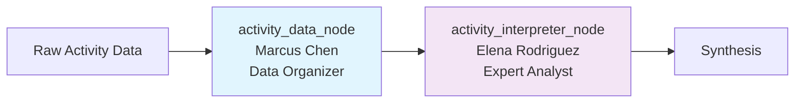
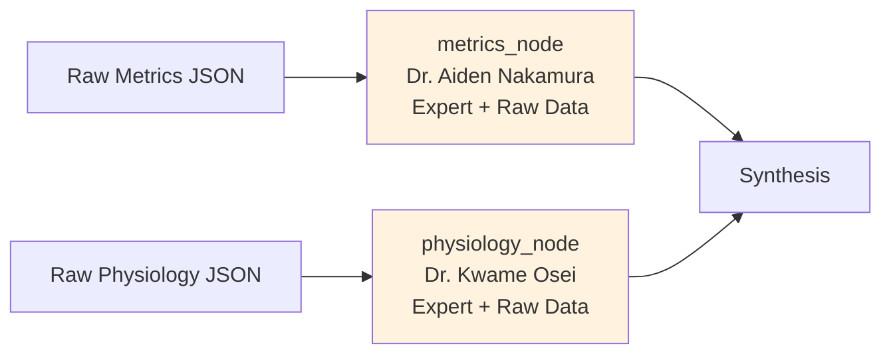
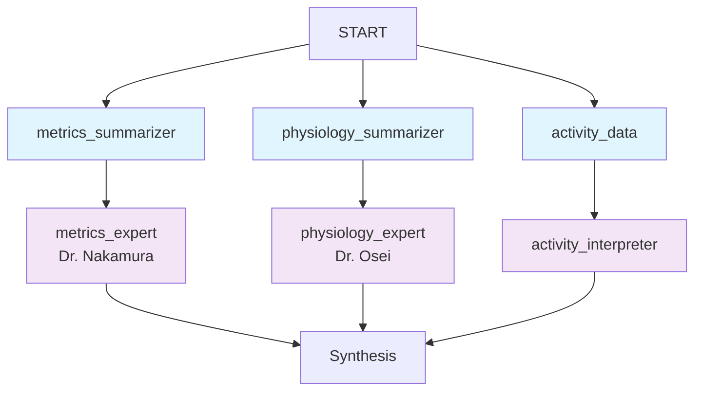
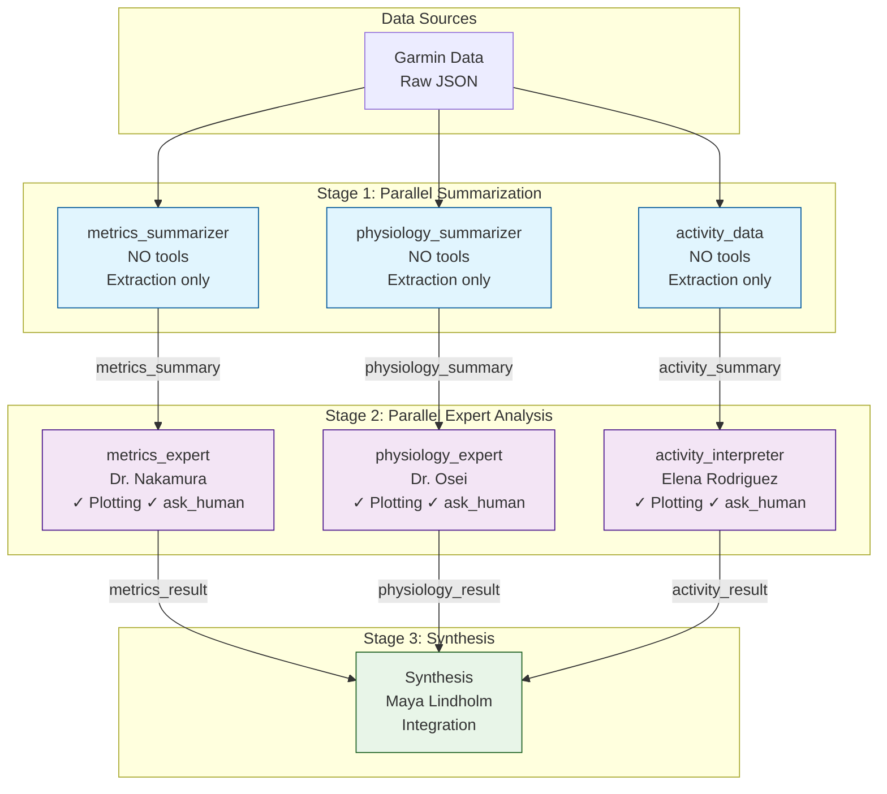

# Data Summarization Agent Architecture Analysis

## Executive Summary

This document analyzes the feasibility and design considerations for introducing **dedicated data summarization agents** in front of the metrics and physiology expert agents, similar to the existing two-stage approach used in the activity analysis path.

## Current Architecture Overview

### Existing Two-Stage Activity Path ✅



**Characteristics:**
- **Stage 1 (activity_data_node)**: Pure data extraction and structuring
  - No tools (no plotting, no ask_human)
  - Objective transformation of raw JSON → structured markdown tables
  - Reduces token pollution by organizing lap data, zone distributions
  - ~3-5K tokens output from potentially 20-50K tokens input

- **Stage 2 (activity_interpreter_node)**: Expert interpretation
  - Has plotting tools (when enabled)
  - Has ask_human tool (when HITL enabled)
  - Works with clean, structured data
  - Performs pattern analysis and quality scoring

### Current Single-Stage Metrics & Physiology Paths



**Current Data Input (per node):**

**Metrics Node receives:**
```python
{
    "training_load_history": [...],  # 56+ days, ~200-500 entries
    "vo2_max_history": {...},        # Running + cycling data
    "training_status": {...}          # Current status snapshot
}
```

**Physiology Node receives:**
```python
{
    "hrv_data": {...},                    # Weekly averages, baselines
    "sleep_data": [...],                  # 56+ days of sleep records
    "stress_data": [...],                 # 56+ days of stress records
    "recovery_metrics": {
        "physiological_markers": {...},
        "body_metrics": {...},
        "recovery_indicators": [...]      # Daily entries
    }
}
```

**Token Impact:**
- Metrics node: ~8-15K tokens of raw JSON
- Physiology node: ~10-20K tokens of raw JSON
- Both nodes must parse, filter, and analyze simultaneously

## Problem Analysis

### Current Challenges

1. **Token Pollution**: Expert agents receive massive JSON dumps
2. **Dual Responsibility**: Experts must both filter data AND provide analysis
3. **Context Waste**: Much of the raw data isn't relevant to the analysis
4. **Prompt Complexity**: Prompts must instruct both data handling and expert analysis
5. **Cost**: High token counts drive up LLM costs

### Activity Path Success Factors

The activity path's two-stage approach works because:
- **Clear separation**: Data extraction vs. interpretation
- **Token reduction**: Structured markdown is more compact than raw JSON
- **Focus**: Each agent has a single, clear purpose
- **Quality**: Expert agent receives pre-digested, relevant information

## Proposed Architecture: Data Summarization Agents

### Design Option 1: Parallel Summarization (Recommended)



**Flow:**
1. **Parallel Stage 1**: Three summarizers run simultaneously
   - `metrics_summarizer`: Extracts key trends from training load/VO2max history
   - `physiology_summarizer`: Extracts recovery patterns from sleep/HRV/stress data
   - `activity_data`: Existing summarizer for activities

2. **Parallel Stage 2**: Three expert agents analyze summarized data
   - Each expert works with clean, focused summaries
   - All have access to plotting and ask_human tools

**Benefits:**
- Maintains parallel execution efficiency
- Clear separation of concerns
- Reduces token usage by 60-70%
- Consistent architecture across all three analysis paths

## Critical Design Questions

### 1. Tool Ownership: Who Gets Plotting & ask_human?

**Three Options:**

#### Option A: Expert Agents Only (Recommended) ✅
```
Summarizers: NO tools (pure extraction)
Expert Agents: Plotting + ask_human tools
```

**Rationale:**
- Matches current activity path design
- Summarizers focus on objective data transformation
- Experts make analysis decisions that may need human input or visualization
- Clear responsibility: experts "own" the interpretation

**Example Scenarios:**
- Metrics expert wants to plot training load trends → Uses plotting tool
- Physiology expert needs clarification about an unusual HRV pattern → Uses ask_human
- Metrics summarizer extracts 56 days of data → No tools needed, just extraction

### 2. What Should Summarizers Extract?

**Important:** We do not hardcode any required output structure. We give the summarizer agents as much freedom as possible in structure. We just provide them the goal and the rationale behind their job, and they decide what is important, and how to extract and format!!

### 3. State Schema Changes

**Add new state fields:**
```python
class TrainingAnalysisState(MessagesState):
    # Existing fields...
    activity_summary: str | None  # Already exists
    
    # NEW: Summarized data
    metrics_summary: str | None      # Output from metrics_summarizer
    physiology_summary: str | None   # Output from physiology_summarizer
    
    # Existing results (now from expert nodes)
    metrics_result: str | None       # From metrics_expert
    physiology_result: str | None    # From physiology_expert
```

### 4. Backward Compatibility
No need for backward compatibility! 
--> Make summarizers default
--> Remove legacy direct paths

## Implementation Plan

### Phase 1: Create Summarizer Nodes ✅ Next Steps
Probably we can define the summarizer agents in such a high level that we can use one and the same agent for both nodes. No domain specific instructions in the summarizer prompts. But let's discuss that wen we reach that point! 
**Create summarizer_node.py**
   - Similar structure to activity_data_node
   - No tools (no plotting, no ask_human)
   - Input: Raw metrics JSON
   - Output: Structured markdown summary

### Phase 2: Refactor Expert Nodes

3. **Rename existing nodes**
   - `metrics_node` → `metrics_expert_node`
   - `physiology_node` → `physiology_expert_node`

4. **Update expert node inputs**
   - Change from raw JSON to summarized markdown
   - Update prompts to expect structured summaries
   - Keep plotting + ask_human tools

### Phase 3: Update Workflow & State

5. **Update analysis_workflow.py**
   - Add new parallel edges for summarizers
   - Connect summarizers → experts
   - Maintain parallel execution

6. **Update training_analysis_state.py**
   - Add metrics_summary field
   - Add physiology_summary field

### Phase 4: Testing & Migration

7. **Create tests**
   - Test summarizer outputs
   - Test expert nodes with summarized inputs
   - Compare token usage before/after

8. **Gradual rollout**
   - Feature flag for new architecture
   - A/B test results quality
   - Monitor cost savings




## Conclusion

The proposed data summarization architecture:
- ✅ **Consistent** with existing activity path design
- ✅ **Clear** separation of concerns (extraction vs analysis)
- ✅ **Efficient** parallel execution maintained
- ✅ **Scalable** easy to add more summarizers/experts
- ✅ **Tool ownership** clearly defined (experts only)
- ✅ **Token optimized** for better cost and quality