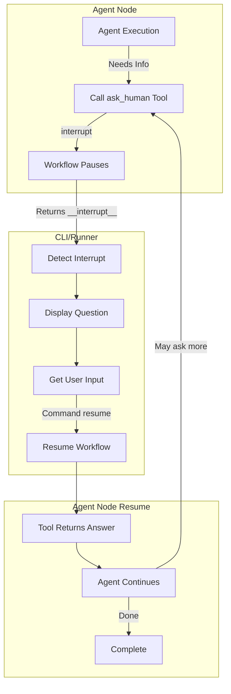

# Human-in-the-Loop (HITL) Integration Plan

## 📋 Executive Summary

This document outlines the plan to integrate Human-in-the-Loop (HITL) capabilities into the Garmin AI Coach agentic workflow. The feature will allow agents (metrics, activity_interpreter, physiology, and planner) to ask clarifying questions during their analysis, pausing execution until the human provides input.

## 🎯 Design Decisions

Based on user requirements:
1. **Interaction Scope**: Agents can ask questions at ANY point during their analysis
2. **Question Types**: No limitations - agents decide what information they need
3. **Execution Flow**: When agent asks question → workflow pauses → user answers → agent continues
4. **Default Behavior**: HITL enabled by default (opt-out via configuration)

## 🏗️ Architecture Overview



## 📁 File Structure

```
services/ai/tools/
├── __init__.py
├── hitl/
│   ├── __init__.py
│   ├── ask_human_tool.py          # NEW: Reusable ask_human tool
│   └── hitl_config.py              # NEW: HITL configuration

services/ai/langgraph/
├── nodes/
│   ├── tool_calling_helper.py      # MODIFY: Handle interrupt-based tools
│   ├── metrics_node.py             # MODIFY: Add ask_human tool support
│   ├── activity_interpreter_node.py # MODIFY: Add ask_human tool support
│   ├── physiology_node.py          # MODIFY: Add ask_human tool support
│   └── weekly_planner_node.py      # MODIFY: Add ask_human tool support
│
├── state/
│   └── training_analysis_state.py  # MODIFY: Add hitl_enabled flag
│
├── workflows/
│   ├── analysis_workflow.py        # MODIFY: Handle interrupts
│   ├── planning_workflow.py        # MODIFY: Handle interrupts
│   └── interactive_runner.py       # NEW: Interactive workflow execution

cli/
├── garmin_ai_coach_cli.py          # MODIFY: Add interactive mode
└── coach_config_template.yaml      # MODIFY: Add hitl_enabled option
```

## 🔧 Implementation Details

### 1. Create Reusable ask_human Tool

**File**: `services/ai/tools/hitl/ask_human_tool.py`

```python
from langchain_core.tools import tool
from langgraph.types import interrupt
from pydantic import BaseModel, Field


class AskHumanInput(BaseModel):
    question: str = Field(
        ..., 
        description="Clear, specific question to ask the human. Be concise and direct."
    )
    context: str = Field(
        default="",
        description="Optional context about why this question is being asked"
    )


@tool("ask_human", args_schema=AskHumanInput)
def ask_human_tool(question: str, context: str = "") -> str:
    """
    Ask the human user for clarification, additional information, or validation.
    
    This tool pauses workflow execution and waits for human input.
    Use when you need information that isn't available in the provided data.
    
    Args:
        question: The question to ask the human
        context: Optional context explaining why you're asking
        
    Returns:
        The human's response as plain text
    """
    payload = {
        "type": "ask_human",
        "question": question,
        "context": context,
    }
    reply = interrupt(payload)
    return reply.get("content", "No response provided")
```

**File**: `services/ai/tools/hitl/__init__.py`

```python
from .ask_human_tool import ask_human_tool, AskHumanInput

__all__ = ["ask_human_tool", "AskHumanInput"]
```

### 2. Update tool_calling_helper.py

The existing [`tool_calling_helper.py`](services/ai/langgraph/nodes/tool_calling_helper.py:1-97) already handles tool execution properly. No major changes needed - it will naturally support tools that use `interrupt()`.

**Key insight**: The `interrupt()` mechanism works within the existing tool execution flow. When a tool calls `interrupt()`, it pauses the entire workflow, not just the tool execution.

### 3. Update Agent Nodes

Each agent node needs to conditionally bind the `ask_human` tool based on `hitl_enabled` flag.

**Pattern to apply to metrics_node.py, activity_interpreter_node.py, physiology_node.py**:

```python
from services.ai.tools.hitl import ask_human_tool

async def metrics_node(state: TrainingAnalysisState) -> dict[str, list | str | dict]:
    logger.info("Starting metrics analysis node")
    
    try:
        plot_storage = PlotStorage(state["execution_id"])
        plotting_enabled = state.get("plotting_enabled", False)
        hitl_enabled = state.get("hitl_enabled", True)  # NEW: Get HITL flag
        
        # Build tools list
        tools = []
        if plotting_enabled:
            plotting_tool = create_plotting_tools(plot_storage, agent_name="metrics")
            tools.append(plotting_tool)
        
        if hitl_enabled:  # NEW: Add ask_human tool
            tools.append(ask_human_tool)
        
        # Bind tools to LLM
        if tools:
            llm_with_tools = ModelSelector.get_llm(AgentRole.METRICS).bind_tools(tools)
        else:
            llm_with_tools = ModelSelector.get_llm(AgentRole.METRICS)
        
        # Update system prompt if HITL enabled
        system_prompt = METRICS_SYSTEM_PROMPT_BASE
        if plotting_enabled:
            system_prompt += METRICS_PLOTTING_INSTRUCTIONS
        if hitl_enabled:  # NEW: Add HITL instructions
            system_prompt += METRICS_HITL_INSTRUCTIONS
        
        # Rest of the node logic...
```

**Add to each agent's system prompt**:

```python
METRICS_HITL_INSTRUCTIONS = """

## 🤝 HUMAN INTERACTION CAPABILITY

You have access to the `ask_human` tool to request clarification or additional information from the user.

**How to use ask_human:**
- Ask ONE clear, specific question at a time
- Provide brief context about why you're asking
- Keep questions focused and actionable
- Don't ask questions if the answer is already in the provided data

**Response handling:**
- Incorporate the human's answer into your analysis
- If the answer raises new questions, you can ask follow-up questions
- Acknowledge the information provided in your final analysis
"""
```

### 4. Update season_planner_node.py

Similar pattern, but the planner doesn't have plotting tools currently:

```python
from services.ai.tools.hitl import ask_human_tool

async def season_planner_node(state: TrainingAnalysisState) -> dict[str, list | str]:
    logger.info("Starting season planner node")
    
    try:
        hitl_enabled = state.get("hitl_enabled", True)
        
        # Conditionally add ask_human tool
        if hitl_enabled:
            llm = ModelSelector.get_llm(AgentRole.SEASON_PLANNER).bind_tools([ask_human_tool])
            system_prompt = SEASON_PLANNER_SYSTEM_PROMPT + SEASON_PLANNER_HITL_INSTRUCTIONS
            
            async def call_season_planning():
                return await handle_tool_calling_in_node(
                    llm_with_tools=llm,
                    messages=[
                        {"role": "system", "content": system_prompt},
                        {"role": "user", "content": SEASON_PLANNER_USER_PROMPT.format(...)},
                    ],
                    tools=[ask_human_tool],
                    max_iterations=15,
                )
        else:
            # Original non-HITL flow
            async def call_season_planning():
                response = await ModelSelector.get_llm(AgentRole.SEASON_PLANNER).ainvoke([...])
                return extract_text_content(response)
        
        season_plan = await retry_with_backoff(
            call_season_planning, AI_ANALYSIS_CONFIG, "Season Planning"
        )
        # ... rest of logic
```

### 5. Update TrainingAnalysisState

**File**: [`services/ai/langgraph/state/training_analysis_state.py`](services/ai/langgraph/state/training_analysis_state.py:1-83)

```python
class TrainingAnalysisState(MessagesState):
    user_id: str
    athlete_name: str
    garmin_data: dict[str, Any]
    analysis_context: str
    planning_context: str

    competitions: list[dict[str, Any]]
    current_date: dict[str, str]
    week_dates: list[dict[str, str]]
    style_guide: str
    plotting_enabled: bool
    hitl_enabled: bool  # NEW: Enable/disable HITL
    
    # ... rest of fields


def create_initial_state(
    user_id: str,
    athlete_name: str,
    garmin_data: dict[str, Any],
    analysis_context: str = "",
    planning_context: str = "",
    competitions: list[dict[str, Any]] | None = None,
    current_date: dict[str, str] | None = None,
    week_dates: list[dict[str, str]] | None = None,
    style_guide: str = "",
    execution_id: str = "",
    plotting_enabled: bool = False,
    hitl_enabled: bool = True,  # NEW: Default to True
) -> TrainingAnalysisState:
    return TrainingAnalysisState(
        # ... existing fields
        plotting_enabled=plotting_enabled,
        hitl_enabled=hitl_enabled,  # NEW
        # ... rest
    )
```

### 6. Create Interactive Workflow Runner

**File**: `services/ai/langgraph/workflows/interactive_runner.py`

```python
import logging
from typing import Any, Callable

from langgraph.types import Command

logger = logging.getLogger(__name__)


class InterruptHandler:
    
    @staticmethod
    def extract_interrupt_payload(result: dict) -> dict | None:
        payload = result.get("__interrupt__")
        if not payload:
            return None
        
        if isinstance(payload, list) and payload:
            payload = payload[0]
        
        if hasattr(payload, "value"):
            payload = payload.value
        
        return payload if isinstance(payload, dict) else None
    
    @staticmethod
    def format_question(payload: dict) -> str:
        question = payload.get("question", "Question not found")
        context = payload.get("context", "")
        
        if context:
            return f"{context}\n\nQuestion: {question}"
        return question


async def run_workflow_with_hitl(
    workflow_app,
    initial_state: dict,
    config: dict,
    prompt_callback: Callable[[str], str],
    progress_callback: Callable[[str], None] | None = None,
) -> dict:
    state = initial_state
    
    while True:
        try:
            result = await workflow_app.ainvoke(state, config=config)
            
            interrupt_payload = InterruptHandler.extract_interrupt_payload(result)
            
            if interrupt_payload:
                question = InterruptHandler.format_question(interrupt_payload)
                
                if progress_callback:
                    progress_callback(f"🤖 Agent Question: {question}")
                
                user_response = prompt_callback(question)
                
                if user_response.lower() in ["quit", "exit", "cancel"]:
                    logger.info("Workflow cancelled by user during HITL interaction")
                    result["cancelled"] = True
                    return result
                
                state = Command(resume={"content": user_response})
                continue
            
            if progress_callback:
                progress_callback("✅ Workflow completed")
            
            return result
            
        except KeyboardInterrupt:
            logger.info("Workflow interrupted by user (Ctrl+C)")
            raise
        except Exception as e:
            logger.error(f"Workflow execution error: {e}")
            raise
```

### 7. Update CLI for Interactive Mode

**File**: [`cli/garmin_ai_coach_cli.py`](cli/garmin_ai_coach_cli.py:1-282)

Key changes in the `run_analysis_from_config` function:

```python
from services.ai.langgraph.workflows.interactive_runner import run_workflow_with_hitl

async def run_analysis_from_config(config_path: Path) -> None:
    # ... existing setup code ...
    
    extraction_settings = config_parser.get_extraction_config()
    hitl_enabled = extraction_settings.get('hitl_enabled', True)  # NEW
    
    logger.info(f"HITL enabled: {hitl_enabled}")
    
    # ... data extraction ...
    
    if hitl_enabled:
        # Use interactive runner
        def prompt_user(question: str) -> str:
            """Prompt user for input."""
            print(f"\n{'='*70}")
            print(f"🤖 AGENT QUESTION:")
            print(f"{'='*70}")
            print(f"\n{question}\n")
            response = input("👤 Your answer: ").strip()
            return response
        
        def show_progress(message: str) -> None:
            """Show progress message."""
            logger.info(message)
        
        # Create workflow
        from services.ai.langgraph.workflows.planning_workflow import (
            create_integrated_analysis_and_planning_workflow
        )
        
        workflow = create_integrated_analysis_and_planning_workflow()
        execution_id = f"cli_user_{datetime.now().strftime('%Y%m%d_%H%M%S')}_complete"
        config = {"configurable": {"thread_id": execution_id}}
        
        result = await run_workflow_with_hitl(
            workflow_app=workflow,
            initial_state=create_initial_state(
                user_id="cli_user",
                athlete_name=athlete_name,
                garmin_data=asdict(garmin_data),
                analysis_context=analysis_context,
                planning_context=planning_context,
                competitions=competitions,
                current_date=current_date,
                week_dates=week_dates,
                execution_id=execution_id,
                plotting_enabled=plotting_enabled,
                hitl_enabled=True,
            ),
            config=config,
            prompt_callback=prompt_user,
            progress_callback=show_progress,
        )
    else:
        # Use existing non-interactive runner
        result = await run_complete_analysis_and_planning(
            user_id="cli_user",
            athlete_name=athlete_name,
            garmin_data=asdict(garmin_data),
            # ... existing parameters ...
            hitl_enabled=False,
        )
    
    # ... save results ...
```

### 8. Update Config Template

**File**: [`cli/coach_config_template.yaml`](cli/coach_config_template.yaml)

```yaml
# ... existing config ...

extraction:
  activities_days: 7
  metrics_days: 14
  ai_mode: "development"  # or "production"
  enable_plotting: false
  hitl_enabled: true  # NEW: Enable Human-in-the-Loop interactions (default: true)

# ... rest of config ...
```

## 📊 Agent-Specific HITL Use Cases

### Metrics Agent
- Clarify unusual training load patterns
- Ask about recent life events affecting metrics
- Validate assumptions about training status interpretation

### Activity Interpreter Agent
- Request context for unusual workout patterns
- Ask about perceived exertion vs. measured metrics
- Clarify workout intent (easy/hard) when data is ambiguous

### Physiology Agent
- Ask about sleep disruptions or stress events
- Request information about illness or injury
- Clarify unusual HRV patterns

### Season Planner Agent
- Ask about race priority preferences
- Clarify scheduling constraints (travel, work)
- Request information about training facilities/environment

## 🧪 Testing Strategy

### Phase 1: Unit Testing
1. Test `ask_human_tool` in isolation with mock interrupt
2. Test `InterruptHandler` payload extraction
3. Test tool binding in agent nodes

### Phase 2: Integration Testing
1. Test single agent with HITL (start with metrics_node)
2. Test workflow interruption and resume
3. Test multiple questions within single agent
4. Test multiple agents asking questions

### Phase 3: End-to-End Testing
1. Run complete workflow with HITL via CLI
2. Test with real Garmin data
3. Verify proper resume after each question
4. Test cancellation during HITL interaction

## 📈 Rollout Plan

### Phase 1: Foundation (Days 1-3)
- Create `ask_human_tool` module
- Update `TrainingAnalysisState` with `hitl_enabled`
- Create `interactive_runner` module
- Write unit tests

### Phase 2: Agent Integration (Days 4-7)
- Update metrics_node with HITL support
- Update activity_interpreter_node with HITL support
- Update physiology_node with HITL support
- Update season_planner_node with HITL support
- Add HITL instructions to system prompts

### Phase 3: CLI & Testing (Days 8-10)
- Update CLI for interactive mode
- Update config template
- Integration testing with single agent
- Full workflow testing

### Phase 4: Documentation & Refinement (Days 11-14)
- Create user documentation
- Add examples directory with HITL demos
- Performance testing
- Bug fixes and refinements

## 🔒 Error Handling

### Timeout Handling
- Add configurable timeout for user responses
- Default: No timeout (wait indefinitely)
- Optional: Timeout after N seconds → resume with "No response"

### Cancellation Handling
- User can type "cancel", "quit", or "exit" to abort
- Workflow saves partial results before exiting
- Clear messaging about cancellation

### Network/Connection Issues
- Checkpoint mechanism ensures resume-ability
- State saved after each agent completion
- Can resume from last checkpoint if interrupted

## 📝 Documentation Requirements

1. **User Guide**: How to use HITL feature
2. **Developer Guide**: How to add HITL to new agents
3. **API Reference**: `ask_human_tool` documentation
4. **Examples**: Interactive demo updates
5. **Configuration Guide**: HITL settings in config file

## 🎓 Best Practices for Agents

1. **Ask Specific Questions**: "Was there illness last week?" not "Tell me about your week"
2. **Provide Context**: Explain why you're asking
3. **One Question at a Time**: Don't overwhelm with multiple questions
4. **Check Data First**: Only ask if answer isn't in provided data
5. **Be Respectful**: User's time is valuable - ask only when necessary

## 🚀 Future Enhancements

1. **Question History**: Store and reuse answers across sessions
2. **Smart Prompting**: Suggest answers based on historical patterns
3. **Async Mode**: Submit questions for later response
4. **Multi-User**: Support coach + athlete simultaneous interaction
5. **Voice Input**: Integrate speech-to-text for answers
6. **Web Interface**: GUI for HITL interactions

## 📐 Architecture Decision Records

### ADR-001: Default HITL Enabled
**Decision**: HITL is enabled by default  
**Rationale**: User wants agents to proactively gather information  
**Implications**: Users must opt-out via config if they want batch processing

### ADR-002: No Question Limitations
**Decision**: Agents can ask any questions they determine are necessary  
**Rationale**: Trust agent's judgment about what information is needed  
**Implications**: May result in more interactions, but more accurate analysis

### ADR-003: Inline Tool Execution
**Decision**: Use existing tool_calling_helper without modifications  
**Rationale**: `interrupt()` works naturally within tool execution flow  
**Implications**: Simpler implementation, leverages existing infrastructure

### ADR-004: Single Interactive Runner
**Decision**: Create separate `interactive_runner.py` module  
**Rationale**: Separation of concerns, reusable across workflows  
**Implications**: Clean abstraction, easy to test and maintain