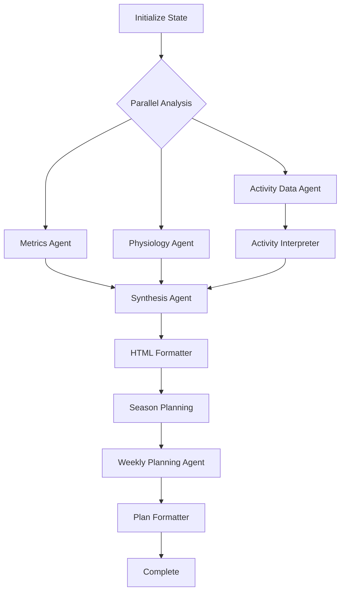

# LangGraph Migration Plan

## Executive Summary

This document outlines the migration strategy from our current LangChain-based agentic flow to LangGraph, with the primary goal of reducing code complexity while improving observability, error handling, and workflow management.

## Current Architecture Analysis

### Existing LangChain Components

#### 1. Master Orchestrator
- **Current**: [`MasterOrchestrator`](../services/ai/langchain/master_orchestrator.py) - Simple sequential coordinator
- **Function**: Runs analysis and planning flows sequentially
- **Issues**: No parallelization, basic error handling, custom progress tracking

#### 2. Analysis Orchestrator  
- **Current**: [`LangChainAnalysisOrchestrator`](../services/ai/langchain/analysis_orchestrator.py) - Complex sequential agent management
- **Agents**: 6 sequential agents (Metrics → Activity Data → Activity Interpreter → Physiology → Synthesis → HTML Formatter)
- **Issues**: 500+ lines of orchestration code, custom cost tracking, manual progress management

#### 3. Weekly Plan Orchestrator
- **Current**: [`LangChainWeeklyPlanOrchestrator`](../services/ai/langchain/weekly_plan_orchestrator.py) - Planning workflow
- **Agents**: 4 sequential agents (Season Planning → Data Integration → Weekly Planning → Plan Formatter)
- **Issues**: Cached data loading, manual state management

#### 4. Supporting Infrastructure
- **Cost Tracking**: Custom [`CostTracker`](../services/ai/utils/cost_tracker.py) implementation
- **Progress Management**: Custom progress managers with async callbacks  
- **Storage**: File-based [`IntermediateResultStorage`](../services/ai/utils/intermediate_storage.py)
- **Error Handling**: Custom retry mechanisms

## LangGraph Migration Strategy

### Core Benefits
1. **Code Reduction**: Replace 800+ lines of orchestration with explicit state graphs (~200-300 lines)
2. **Built-in Observability**: LangSmith integration for cost tracking and monitoring
3. **State Management**: Typed state with automatic persistence via checkpointers
4. **Streaming**: Real-time progress updates without custom callbacks
5. **Error Resilience**: Built-in retry and recovery mechanisms
6. **Parallelization**: Enable concurrent agent execution where appropriate

### State Schema Design

```python
from typing import Annotated, List, Dict, Any, Optional
from typing_extensions import TypedDict
from langgraph.graph.message import add_messages

class TrainingAnalysisState(TypedDict):
    # Input data
    user_id: str
    athlete_name: str
    garmin_data: Dict[str, Any]
    analysis_context: str
    planning_context: str
    
    # Agent results (with reducers for parallel execution)
    metrics_result: Optional[str]
    activity_summary: Optional[str]
    activity_result: Optional[str]
    physiology_result: Optional[str]
    synthesis_result: Optional[str]
    
    # Planning results
    season_plan: Optional[str]
    weekly_plan: Optional[str]
    
    # Final outputs
    analysis_html: Optional[str]
    planning_html: Optional[str]
    
    # Infrastructure
    plots: Annotated[List[Dict], lambda x, y: x + y]  # Reducer for plot aggregation
    costs: Annotated[List[Dict], lambda x, y: x + y]  # Reducer for cost tracking
    errors: Annotated[List[str], lambda x, y: x + y]  # Error collection
    
    # Metadata
    competitions: List[Dict[str, Any]]
    current_date: Dict[str, str]
    available_plots: List[str]
```

## Migration Architecture

### 1. Graph Structure



### 2. Node Implementation Strategy

#### Replace Orchestrator Classes with Node Functions
```python
# Current: 100+ lines of orchestrator logic per agent
async def metrics_agent_node(state: TrainingAnalysisState) -> TrainingAnalysisState:
    """Metrics analysis node - replaces metrics orchestration logic"""
    # Single focused function, LangSmith handles cost tracking
    result = await metrics_chain.ainvoke({
        'data': state['garmin_data']['training_load_history'],
        'competitions': state['competitions']
    })
    return {"metrics_result": result}
```

#### Parallel Execution Opportunities
- **Metrics + Physiology**: Can run in parallel (independent data sources)
- **Activity Data → Activity Interpreter**: Must remain sequential
- **All planning agents**: Currently sequential by design, could evaluate parallelization

### 3. Infrastructure Simplification

#### Replace Custom Components with LangGraph Built-ins

| Current Component | LangGraph Replacement | Code Reduction |
|-------------------|----------------------|----------------|
| `CostTracker` | LangSmith integration | ~150 lines → 10 lines |
| `IntermediateResultStorage` | Checkpointer persistence | ~200 lines → Built-in |
| Progress callbacks | Streaming API | ~100 lines → Built-in |
| Retry mechanisms | Node-level error handling | ~75 lines → 20 lines |
| Plot storage | State-based storage | ~100 lines → 30 lines |

## Implementation Plan

### Phase 1: Foundation Setup
1. **Create Migration Branch**: `feature/langgraph-migration`
2. **Dependencies**: Add LangGraph, LangSmith to project
3. **State Schema**: Define `TrainingAnalysisState` 
4. **LangSmith Setup**: Configure observability

### Phase 2: Analysis Workflow Migration
1. **Convert Analysis Agents**: Transform each agent class to node function
2. **Implement State Graph**: Create analysis workflow graph
3. **Parallel Execution**: Enable Metrics + Physiology parallel execution
4. **Plot Integration**: Migrate plotting to state-based storage
5. **Testing**: Validate analysis results match current system

### Phase 3: Planning Workflow Migration
1. **Convert Planning Agents**: Transform planning orchestrator
2. **State Integration**: Connect analysis → planning workflow
3. **Checkpointer**: Implement persistence for resumable workflows
4. **Cache Migration**: Replace file-based caching with state persistence

### Phase 4: Infrastructure Migration
1. **Progress Streaming**: Replace custom callbacks with LangGraph streaming
2. **Error Handling**: Implement node-level retry and error collection
3. **Cost Tracking**: Full LangSmith integration
4. **Monitoring**: Set up operational observability

### Phase 5: Testing & Validation
1. **Unit Tests**: Node-level testing
2. **Integration Tests**: Full workflow validation
3. **Performance Comparison**: Before/after metrics
4. **Production Deployment**: Gradual rollout with feature flags

## Code Reduction Analysis

### Expected Reductions
- **Orchestrator Logic**: 800+ lines → 300 lines (~60% reduction)
- **Infrastructure Code**: 625 lines → 150 lines (~75% reduction)
- **Error Handling**: 150 lines → 50 lines (~65% reduction)
- **Progress Management**: 200 lines → Built-in streaming
- **Total Estimated Reduction**: ~1,200 lines → ~400 lines (**67% reduction**)

### Complexity Improvements
- **State Management**: From implicit to explicit typed state
- **Observability**: Custom tracking → Professional LangSmith dashboards
- **Debugging**: Graph visualization in LangGraph Studio
- **Resilience**: Built-in checkpointing and resumability
- **Scalability**: Parallel execution capabilities

## Risk Analysis & Mitigation

### Risks
1. **Learning Curve**: Team unfamiliarity with LangGraph
2. **Feature Parity**: Ensuring all current functionality is preserved
3. **Performance**: Potential overhead from graph execution
4. **Dependencies**: Additional complexity with LangSmith

### Mitigation Strategies
1. **Parallel Development**: Keep current system running during migration
2. **Incremental Testing**: Validate each component during migration
3. **Feature Flags**: Gradual rollout with ability to rollback
4. **Documentation**: Comprehensive documentation of new architecture

## Success Metrics

### Technical Metrics
- [ ] 60%+ reduction in orchestration code lines
- [ ] 100% feature parity with current system
- [ ] <10% performance degradation
- [ ] Real-time progress streaming functionality
- [ ] Built-in cost tracking and monitoring

### Operational Metrics
- [ ] Improved debugging capabilities with graph visualization
- [ ] Automated resumability from checkpoints
- [ ] Professional observability with LangSmith dashboards
- [ ] Simplified error handling and recovery

## Next Steps

1. **Approval**: Get stakeholder approval for migration plan
2. **Branch Creation**: Create `feature/langgraph-migration` branch
3. **Proof of Concept**: Implement single agent as LangGraph node
4. **Team Training**: LangGraph workshop and documentation
5. **Begin Implementation**: Start with Phase 1 foundation setup

## Documentation Updates Required

### Files to Update
- [`techStack.md`](techStack.md): Add LangGraph and LangSmith
- [`codebaseSummary.md`](codebaseSummary.md): Update AI pipeline architecture
- [`currentTask.md`](currentTask.md): Reflect migration as current focus

### New Documentation
- LangGraph workflow diagrams
- State schema documentation  
- Migration progress tracking
- Operational runbooks for new architecture