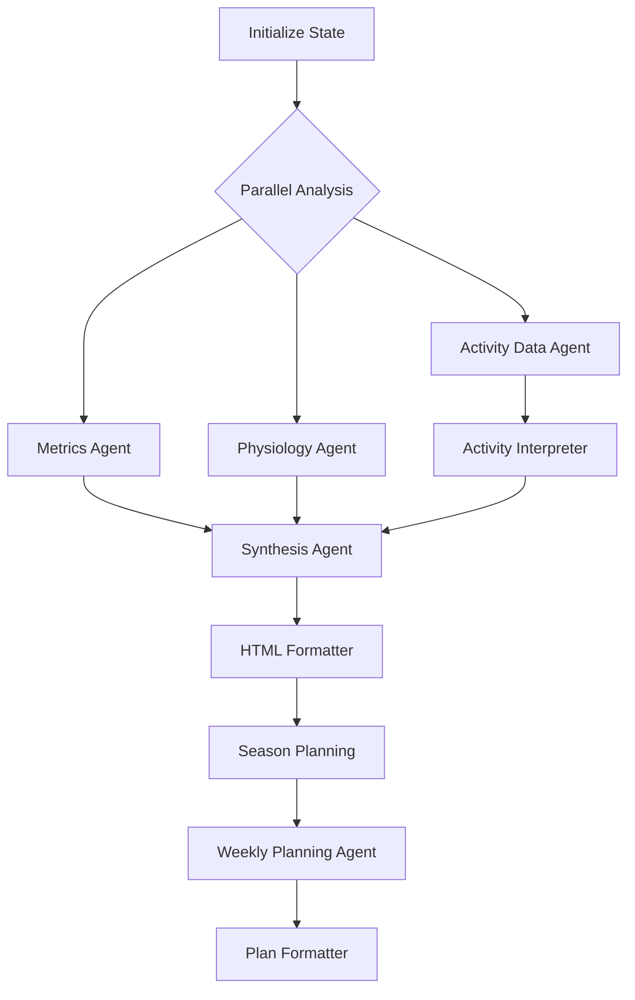

# LangGraph Node Structure Analysis

## Current Architecture Analysis

### Analysis Orchestrator Workflow
**File**: [`services/ai/langchain/analysis_orchestrator.py`](../services/ai/langchain/analysis_orchestrator.py) (500+ lines)

#### Sequential Agent Flow
1. **Metrics Agent** (with plotting tools)
   - Input: `training_load_history`, `vo2_max_history`, `training_status`
   - Tools: PythonPlottingTool (max 2 plots)
   - Output: Training load and performance metrics analysis

2. **Activity Data Agent** (simple chain)
   - Input: `recent_activities`, `training_status`
   - Tools: None
   - Output: Raw activity data summary

3. **Activity Interpreter Agent** (with plotting tools)
   - Input: Activity summary from previous agent
   - Tools: PythonPlottingTool (max 2 plots)
   - Output: Training pattern interpretation

4. **Physiology Agent** (simple chain)
   - Input: `recovery_indicators`, `daily_stats`, `physiological_markers`
   - Tools: None
   - Output: Recovery and physiological analysis

5. **Synthesis Agent** (simple chain)
   - Input: All previous agent results + available plots
   - Tools: None
   - Output: Comprehensive analysis synthesis

6. **HTML Formatter Agent** (simple chain)
   - Input: Synthesis result
   - Tools: None
   - Output: Final HTML report

### Weekly Plan Orchestrator Workflow
**File**: [`services/ai/langchain/weekly_plan_orchestrator.py`](../services/ai/langchain/weekly_plan_orchestrator.py) (300 lines)

#### Sequential Planning Flow
1. **Season Planning Agent**
   - Input: Athlete name, competitions, current date
   - Output: Season-long training strategy

2. **Data Integration Agent**
   - Input: Cached analysis results from SecureCache
   - Output: Loaded previous analysis context

3. **Weekly Planning Agent**
   - Input: Season plan + cached analysis + planning context
   - Output: Detailed two-week training schedule

4. **Plan Formatter Agent**
   - Input: Season plan + weekly plan
   - Output: Final HTML weekly plan

## Identified Dependencies and Parallelization Opportunities

### Parallel Execution Potential


**Parallel Groups**:
- **Group 1**: Metrics Agent + Physiology Agent (independent data sources)
- **Group 2**: Activity Data Agent → Activity Interpreter Agent (sequential dependency)
- **Group 3**: All analysis results → Synthesis Agent (requires all previous completion)

## Current Infrastructure to Replace

### Cost Tracking (150+ lines → 10 lines)
```python
# Current: Custom CostTracker class
self.cost_tracker = CostTracker()
agent_cost_summary = self.cost_tracker.add_agent_cost(
    "Metrics Agent", cb.usage_metadata, execution_time
)

# LangGraph: Built-in LangSmith tracking
# Automatic cost tracking per workflow execution
```

### Progress Management (100+ lines → Built-in)
```python
# Current: Custom progress manager with async callbacks
if self.progress_manager:
    await self.progress_manager.agent_started("Metrics Agent", "description")
    await self.progress_manager.agent_completed("Metrics Agent", **stats)

# LangGraph: Streaming API
# Real-time progress updates without custom callbacks
```

### Persistence (200+ lines → Built-in)
```python
# Current: File-based IntermediateResultStorage
storage = IntermediateResultStorage(self.athlete_name)
stored_files = storage.store_analysis_results(intermediate_results)

# LangGraph: Checkpointer-based persistence
# Built-in state persistence and resumability
```

### Retry Logic (75+ lines → 20 lines)
```python
# Current: Custom retry_with_backoff mechanism
async def call_metrics_agent():
    return await metrics_chain.ainvoke({...})

metrics_response = await retry_with_backoff(
    call_metrics_agent, AI_ANALYSIS_CONFIG, "Metrics Agent"
)

# LangGraph: Node-level error handling
# Built-in retry and error recovery per node
```

## Proposed LangGraph State Schema

```python
from typing import Annotated, List, Dict, Any, Optional
from typing_extensions import TypedDict
from langgraph.graph.message import add_messages

class TrainingAnalysisState(TypedDict):
    # Input data
    user_id: str
    athlete_name: str
    garmin_data: Dict[str, Any]
    analysis_context: str
    planning_context: str
    
    # Static context data
    competitions: List[Dict[str, Any]]
    current_date: Dict[str, str]
    week_dates: List[Dict[str, str]]
    style_guide: str
    
    # Agent results (with optional for parallel execution)
    metrics_result: Optional[str]
    activity_summary: Optional[str]  # From Activity Data Agent
    activity_result: Optional[str]   # From Activity Interpreter Agent
    physiology_result: Optional[str]
    synthesis_result: Optional[str]
    
    # Planning results
    season_plan: Optional[str]
    weekly_plan: Optional[str]
    
    # Final outputs
    analysis_html: Optional[str]
    planning_html: Optional[str]
    
    # Infrastructure with reducers for aggregation
    plots: Annotated[List[Dict], lambda x, y: x + y]  # Plot aggregation
    costs: Annotated[List[Dict], lambda x, y: x + y]  # Cost tracking
    errors: Annotated[List[str], lambda x, y: x + y]  # Error collection
    tool_usage: Annotated[Dict[str, int], lambda x, y: {**x, **y}]  # Tool stats
    
    # Metadata for tools
    available_plots: List[str]
    execution_id: str
```

## Node Implementation Strategy

### 1. Analysis Nodes (Replace AnalysisOrchestrator)

#### Metrics Node
```python
async def metrics_node(state: TrainingAnalysisState) -> TrainingAnalysisState:
    """Metrics analysis node - replaces metrics orchestration logic"""
    metrics_chain = create_metrics_chain(
        plot_storage=state["execution_id"],
        user_id=state["user_id"]
    )
    
    result = await metrics_chain.ainvoke({
        'data': {
            'training_load_history': state['garmin_data']['training_load_history'],
            'vo2_max_history': state['garmin_data']['vo2_max_history'],
            'training_status': state['garmin_data']['training_status'],
        },
        'competitions': state['competitions'],
        'current_date': state['current_date'],
        'analysis_context': state['analysis_context'],
    })
    
    return {"metrics_result": extract_agent_output(result)}
```

#### Physiology Node (Parallel with Metrics)
```python
async def physiology_node(state: TrainingAnalysisState) -> TrainingAnalysisState:
    """Physiology analysis node - runs in parallel with metrics"""
    physiology_chain = create_physiology_chain()
    
    result = await physiology_chain.ainvoke({
        'data': {
            'recovery_indicators': state['garmin_data']['recovery_indicators'],
            'daily_stats': state['garmin_data']['daily_stats'],
            'physiological_markers': state['garmin_data']['physiological_markers'],
        },
        'competitions': state['competitions'],
        'current_date': state['current_date'],
        'analysis_context': state['analysis_context'],
    })
    
    return {"physiology_result": extract_agent_output(result)}
```

#### Activity Data Node (Sequential Start)
```python
async def activity_data_node(state: TrainingAnalysisState) -> TrainingAnalysisState:
    """Activity data processing node"""
    activity_data_chain = create_activity_data_chain()
    
    result = await activity_data_chain.ainvoke({
        'data': {
            'recent_activities': state['garmin_data']['recent_activities'],
            'training_status': state['garmin_data']['training_status'],
        }
    })
    
    return {"activity_summary": extract_agent_output(result)}
```

#### Activity Interpreter Node (Sequential after Activity Data)
```python
async def activity_interpreter_node(state: TrainingAnalysisState) -> TrainingAnalysisState:
    """Activity interpretation node - depends on activity_data_node"""
    activity_interpreter_chain = create_activity_interpreter_chain(
        plot_storage=state["execution_id"],
        user_id=state["user_id"]
    )
    
    result = await activity_interpreter_chain.ainvoke({
        'activity_summary': state['activity_summary'],
        'competitions': state['competitions'],
        'current_date': state['current_date'],
        'analysis_context': state['analysis_context'],
    })
    
    return {"activity_result": extract_agent_output(result)}
```

#### Synthesis Node (Combines All Analysis)
```python
async def synthesis_node(state: TrainingAnalysisState) -> TrainingAnalysisState:
    """Synthesis node - combines all analysis results"""
    synthesis_chain = create_synthesis_chain()
    
    result = await synthesis_chain.ainvoke({
        'athlete_name': state['athlete_name'],
        'metrics_result': state['metrics_result'],
        'activity_result': state['activity_result'],
        'physiology_result': state['physiology_result'],
        'competitions': state['competitions'],
        'current_date': state['current_date'],
        'style_guide': state['style_guide'],
        'available_plots': state['available_plots'],
    })
    
    return {"synthesis_result": extract_agent_output(result)}
```

### 2. Planning Nodes (Replace WeeklyPlanOrchestrator)

#### Season Planning Node
```python
async def season_planning_node(state: TrainingAnalysisState) -> TrainingAnalysisState:
    """Season planning node"""
    season_planner_chain = create_season_planner_chain()
    
    result = await season_planner_chain.ainvoke({
        'athlete_name': state['athlete_name'],
        'competitions': json.dumps(state['competitions'], indent=2),
        'current_date': json.dumps(state['current_date'], indent=2),
    })
    
    return {"season_plan": result}
```

### 3. Graph Structure Definition

```python
from langgraph.graph import StateGraph

# Create the graph
workflow = StateGraph(TrainingAnalysisState)

# Add analysis nodes
workflow.add_node("metrics", metrics_node)
workflow.add_node("physiology", physiology_node)
workflow.add_node("activity_data", activity_data_node)
workflow.add_node("activity_interpreter", activity_interpreter_node)
workflow.add_node("synthesis", synthesis_node)
workflow.add_node("html_formatter", html_formatter_node)

# Add planning nodes
workflow.add_node("season_planning", season_planning_node)
workflow.add_node("weekly_planning", weekly_planning_node)
workflow.add_node("plan_formatter", plan_formatter_node)

# Define edges for parallel execution
workflow.add_edge("START", "metrics")
workflow.add_edge("START", "physiology") 
workflow.add_edge("START", "activity_data")

workflow.add_edge("activity_data", "activity_interpreter")

# All analysis feeds into synthesis
workflow.add_edge("metrics", "synthesis")
workflow.add_edge("physiology", "synthesis")
workflow.add_edge("activity_interpreter", "synthesis")

# Continue to formatting and planning
workflow.add_edge("synthesis", "html_formatter")
workflow.add_edge("html_formatter", "season_planning")
workflow.add_edge("season_planning", "weekly_planning")
workflow.add_edge("weekly_planning", "plan_formatter")
workflow.add_edge("plan_formatter", "END")

# Set entry and finish points
workflow.set_entry_point("START")
workflow.set_finish_point("END")
```

## Expected Code Reduction

| Component | Current Lines | LangGraph Lines | Reduction |
|-----------|---------------|----------------|-----------|
| Analysis Orchestrator | 500+ | ~150 | 70% |
| Weekly Plan Orchestrator | 300+ | ~100 | 67% |
| Cost Tracking | 150+ | 10 | 93% |
| Progress Management | 100+ | Built-in | 100% |
| Persistence | 200+ | Built-in | 100% |
| Retry Logic | 75+ | 20 | 73% |
| **Total** | **1,325+ lines** | **~280 lines** | **79% reduction** |

## Next Steps for Implementation

1. **Create LangGraph State Schema** - Define typed state with reducers
2. **Convert Analysis Agents** - Start with metrics node as proof of concept
3. **Implement Parallel Execution** - Metrics + Physiology in parallel
4. **Add Planning Workflow** - Convert planning orchestrator
5. **Replace Infrastructure** - LangSmith integration and checkpointers
6. **Testing & Validation** - Ensure feature parity with current system

This analysis provides the detailed blueprint for migrating from the current 1,300+ line orchestrator system to a ~280 line LangGraph implementation with 79% code reduction while gaining parallelization, better observability, and built-in persistence.